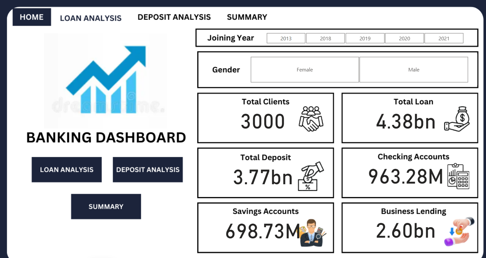
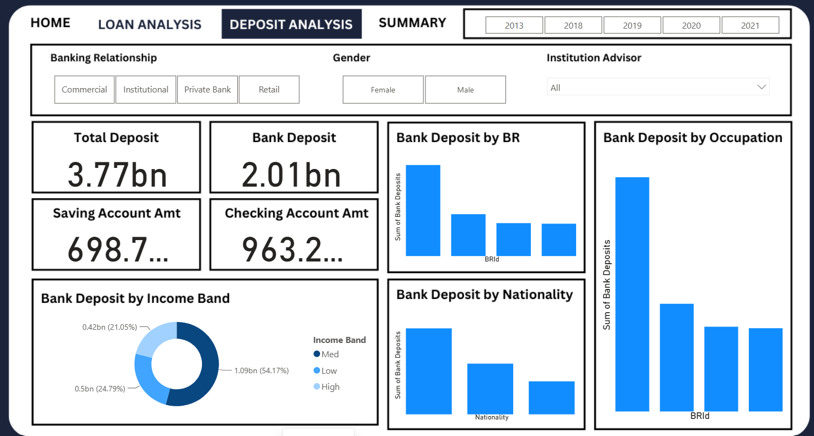
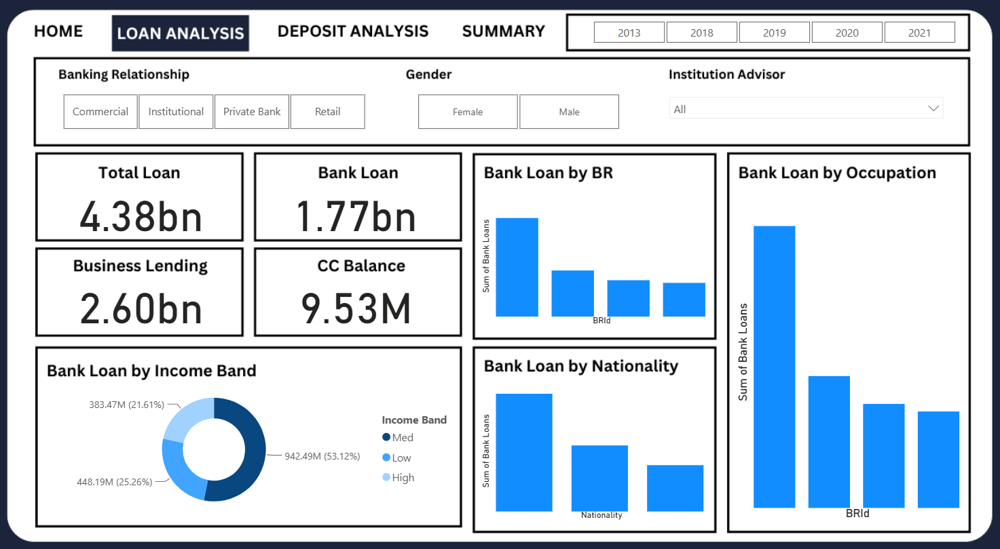

# 🏦 Banking Analysis

An end-to-end **Banking Data Analytics project** focused on analyzing customer financial behavior, banking products, loans, deposits, and customer risk using **Python, SQL, Excel, and Power BI**.

The project transforms raw banking data into meaningful business insights through **data cleaning, exploratory data analysis, SQL analysis, and interactive Power BI dashboards**.

---

## 📌 Project Overview

The objective of this project is to analyze banking customer data and identify patterns related to:

* Customer demographics
* Banking products
* Loans and deposits
* Customer financial behavior
* Credit and risk indicators
* Account balances
* Customer segmentation
* Financial relationships and correlations

The analysis follows an end-to-end data analytics workflow:

```text
Raw Data
   ↓
Data Cleaning
   ↓
Exploratory Data Analysis
   ↓
SQL Analysis
   ↓
Data Modeling
   ↓
Power BI Dashboard
   ↓
Business Insights
```

---

## 🎯 Business Objectives

This project focuses on answering important banking-related questions such as:

* How are customers distributed across different banking products?
* Which customer segments contribute the most to loans and deposits?
* What is the relationship between income and financial products?
* Which account types have the highest balances?
* Which customer segments have higher financial risk?
* How are loans and deposits distributed across customers?
* Which demographic groups contribute the most to banking activity?
* What patterns can be identified from customer financial behavior?

---

# 🗂️ Project Structure

```text
Banking Analysis/
│
├── dashboard-imgs/
│   ├── deposit-analysis.png
│   ├── home.png
│   ├── loan-analysis.png
│
├── dataset/
│   └── banking-data.xlsx
│
├── Banking Analysis.ipynb
│
├── SQL Queries.sql
│
├── Banking Analysis.pbix
│
└── README.md
```

> The exact files may vary depending on the current version of the project.

---

# 🛠️ Tools & Technologies

| Tool           | Purpose                                |
| -------------- | -------------------------------------- |
| 🐍 Python      | Data cleaning and exploratory analysis |
| 🐼 Pandas      | Data manipulation and preprocessing    |
| 🔢 NumPy       | Numerical analysis                     |
| 📊 Matplotlib  | Data visualization                     |
| 📈 Seaborn     | Statistical visualization              |
| 🗄️ SQL        | Data querying and business analysis    |
| 📊 Power BI    | Interactive dashboard development      |
| 📗 Excel       | Data inspection and preparation        |
| 🧮 DAX         | Power BI calculations and KPIs         |
| 🔄 Power Query | Data transformation                    |

---

# 📊 Data Analysis Workflow

## 1️⃣ Data Collection

The banking dataset contains customer-level financial information related to banking products, loans, deposits, income, and customer demographics.

---

## 2️⃣ Data Cleaning

Python and Power Query were used to prepare the dataset for analysis.

Key preprocessing activities included:

* Handling missing values
* Removing duplicate records
* Checking data types
* Standardizing categorical values
* Validating numerical columns
* Identifying inconsistent records
* Preparing data for visualization
* Creating derived analytical columns

---

## 3️⃣ Exploratory Data Analysis

Exploratory Data Analysis was performed using Python libraries such as:

```python
Pandas
NumPy
Matplotlib
Seaborn
```

The EDA focused on:

* Distribution analysis
* Customer segmentation
* Financial product analysis
* Correlation analysis
* Income analysis
* Loan analysis
* Deposit analysis
* Risk-related patterns
* Demographic analysis

---

# 🗄️ SQL Analysis

SQL was used to perform business-oriented analysis on the banking data.

The analysis included:

* Customer segmentation
* Loan analysis
* Deposit analysis
* Account analysis
* Income-based analysis
* Risk analysis
* Aggregation and grouping
* Ranking customers
* Identifying high-value customers
* Comparing customer segments

Example SQL concepts used:

```sql
SELECT
GROUP BY
HAVING
ORDER BY
CASE
JOIN
Aggregate Functions
Subqueries
Window Functions
```

---

# 📊 Power BI Dashboard

The cleaned and transformed data was used to create an interactive **Power BI Banking Dashboard**.

The dashboard provides a visual overview of customer financial behavior and banking performance.

### Dashboard Features

* KPI cards
* Customer segmentation
* Loan analysis
* Deposit analysis
* Account analysis
* Income analysis
* Risk analysis
* Demographic analysis
* Interactive filters
* Charts and visualizations
* Drill-down analysis

---

# 🖥️ Dashboard Preview

## 📌 Dashboard 1



---

## 📌 Dashboard 2



---

## 📌 Dashboard 3



---

# 📈 Key Analysis Areas

## 👥 Customer Analysis

The project analyzes customers based on:

* Income
* Gender
* Nationality
* Occupation
* Banking products
* Account types
* Financial activity

This helps identify differences in customer behavior across different segments.

---

## 💰 Deposit Analysis

Deposit-related analysis focuses on:

* Total deposits
* Savings accounts
* Checking accounts
* Foreign currency accounts
* Deposit distribution
* Customer-level deposit behavior

---

## 💳 Loan Analysis

Loan analysis focuses on:

* Total loans
* Loan distribution
* Customer income vs loan exposure
* Customer segments with higher loan amounts
* Loan-related financial patterns

---

## ⚠️ Risk Analysis

The project also examines customer financial risk using available customer and financial attributes.

The analysis can help identify:

* High-risk customers
* Low-risk customers
* High financial exposure
* Loan-heavy customer segments
* Customers with significant financial balances

---

# 📊 Dashboard KPIs

The Power BI dashboard tracks important banking KPIs such as:

* 👥 Total Customers
* 💰 Total Deposits
* 💳 Total Loans
* 🏦 Savings Account Balance
* 🏦 Checking Account Balance
* 💵 Business Lending
* 💳 Credit Card Balance
* 💼 Estimated Income
* 🌍 Foreign Currency Account
* 📊 Customer Risk Indicators

---

# 🔍 Key Insights

The analysis provides insights into:

### Customer Behavior

Understanding how different customer segments use banking products.

### Financial Products

Identifying the most commonly used banking products and account types.

### Loans & Deposits

Comparing customer loan exposure with their deposits and account balances.

### Income & Financial Activity

Understanding how customer income relates to banking activity.

### Risk

Identifying customer segments that require additional financial-risk analysis.

---

# 📸 Dashboard Screenshots

All dashboard screenshots are stored in:

```text
dashboard-imgs/
```

The screenshots are included directly in this README so that visitors can preview the dashboard without opening Power BI.

---

# 🧠 Skills Demonstrated

This project demonstrates practical skills in:

* Data Cleaning
* Data Preprocessing
* Exploratory Data Analysis
* Data Visualization
* SQL Querying
* Data Modeling
* Power BI
* DAX
* Power Query
* Business Intelligence
* KPI Development
* Customer Segmentation
* Financial Analysis
* Risk Analysis
* Data Storytelling

---

# 🚀 Project Outcome

This project demonstrates how raw banking data can be transformed into an interactive analytics solution that helps understand:

```text
Customer Behavior
       ↓
Financial Products
       ↓
Loans & Deposits
       ↓
Customer Segmentation
       ↓
Risk Analysis
       ↓
Business Insights
```

The final Power BI dashboard provides an interactive way to explore banking data and communicate analytical findings through visual storytelling.

---

# 📁 Repository

🔗 **GitHub Repository:**
https://github.com/theaditya24/DATA-ANALYTICS-Projects/tree/main/Banking%20Analysis

---

# 👨‍💻 Author

**Aryan Raj**

Aspiring Data Analyst | Python | SQL | Excel | Power BI

---

⭐ If you found this project useful, consider giving the repository a star!
